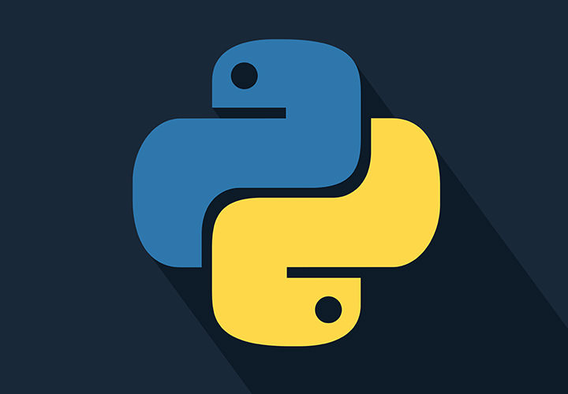

# Python Practice Exercises

This project contains a collection of Python exercises designed for developers of different skill levels. Each exercise is contained in its own file and focuses on a specific concept or problem.

## Getting Started

### Prerequisites

- Python 3.x

### Installation

1. Navigate to the project directory:
    ```sh
    cd path/to/project
    ```

2. Clone the repository:
    ```sh
    git clone https://github.com/alej33ch/beginning.git
    ```


## Contributing

Contributions are welcome! Please fork the repository and create a pull request.

## License

This project is licensed under the MIT License. See the `LICENSE` file for details.


