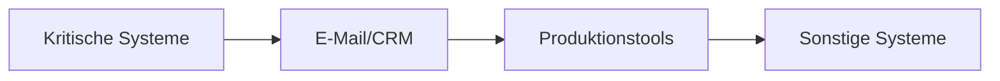

```markdown
# 🚨 Incident Response Playbook (KMU Edition)  
**Optimiert für GitLab**  

---

## 📌 Einführung  
Dieses Playbook bietet eine klare Anleitung für die Reaktion auf Sicherheitsvorfälle in kleinen Unternehmen. Es ist speziell für Teams mit begrenzten IT-Ressourcen entwickelt.  

---

## 🔍 1. Vorfallerkennung  

### 🚩 Anzeichen eines Vorfalls  
- **Netzwerk:** Ungewöhnlicher Datenverkehr, langsame Verbindungen  
- **Systeme:** Unerwartete Abstürze, hohe CPU-Auslastung  
- **Zugriff:** Verdächtige Anmeldeversuche, unbekannte Benutzer  

### 📋 Meldeprotokoll  
1. **Sofortmaßnahmen:**  
   - 📞 IT-Primärkontakt anrufen  
   - ✉️ E-Mail an `incident@firma.de` mit:  
     - Betroffenes Gerät  
     - Vorfallszeitpunkt  
     - Screenshot (wenn sicher)  

2. **IT-Checkliste:**  
   - [ ] Vorfall bestätigen  
   - [ ] Schweregrad einstufen (siehe Tabelle)  
   - [ ] Notfallprotokoll aktivieren  

| **Schweregrad** | **Kriterien** | **Reaktionszeit** |  
|-----------------|---------------|-------------------|  
| **Stufe 1** (Kritisch) | Ransomware, Totalausfall | Sofort, 24/7 |  
| **Stufe 2** (Hoch) | Phishing, Datenleck | <2 Stunden |  
| **Stufe 3** (Gering) | Langsame Leistung | Innerhalb der Arbeitszeit |  

---

## 🛡️ 2. Eindämmung  

### 🚧 Prioritätsmaßnahmen  
1. **Isolation:**  
   - Gerät vom Netzwerk trennen (Kabel/WLAN deaktivieren)  
   - Domain-Passwörter sofort ändern  
   - Remote-Zugänge sperren (TeamViewer/AnyDesk)  

2. **Basis-Schutz:**  
   ```powershell
   # Windows Notfallbefehle:
   netsh advfirewall reset  # Firewall zurücksetzen
   net user * /domain       # Aktive Konten prüfen
   ```

### 🌐 Netzwerksicherung  
- [ ] Router zurücksetzen  
- [ ] DNS auf 1.1.1.1 (Cloudflare) umstellen  
- [ ] Gast-WLAN deaktivieren  

---

## 🕵️ 3. Analyse  

### 🛠️ Tools für kleine Teams  
| **Tool** | **Zweck** |  
|----------|-----------|  
| **Canary Tokens** | Einfache Erkennung von Datenlecks |  
| **VirusTotal** | Schnellscan von Dateien |  
| **HaveIBeenPwned** | Passwort-Check |  

### 📄 Dokumentationsvorlage  
```markdown
- **Vorfallszeit:** [DD.MM.YYYY HH:MM]  
- **Betroffene Systeme:**  
  - [ ] Windows-PCs  
  - [ ] Cloud-Dienste  
  - [ ] Mobile Geräte  
- **Erste Maßnahmen:** [Liste]  
```

---

## 🔄 4. Wiederherstellung  

### 💾 Backup-Protokoll  
1. Letztes "sauberes" Backup identifizieren  
2. 3-2-1-Regel prüfen:  
   - 3 Kopien  
   - 2 verschiedene Medien  
   - 1 externes Backup  

### 📊 Wiederanlaufplan  


---

## 📝 5. Nachbearbeitung  

### 📋 Vereinfachte Dokumentation  
1. Vorfallsformular ausfüllen:  
   - Dauer des Ausfalls  
   - Finanzieller Schaden (geschätzt)  
   - Verbesserungsvorschläge  

2. Mitarbeiterschulung:  
   - [ ] Monatlicher Security-Newsletter  
   - [ ] Quartals-Workshop zu Phishing  

---

## 🛠️ 6. Prävention  

### 💡 Kosteneffiziente Maßnahmen  
| **Maßnahme** | **Kosten** | **Implementierungszeit** |  
|--------------|------------|--------------------------|  
| Multi-Faktor-Authentifizierung | Kostenlos (Microsoft Authenticator) | 1 Stunde |  
| Cloud-Backups (Wasabi/iDrive) | ~20€/Monat | 2 Stunden |  
| Grundschutz-Training (BSI) | Kostenlos | 30 Min/Monat |  

### ✅ Monatliche IT-Checkliste  
- [ ] Passwort-Rotation für Admin-Konten  
- [ ] Sicherheitsupdates prüfen  
- [ ] Externe Zugriffe überprüfen  

---

## 📞 Notfallkontakte  
- 🔧 **IT-Primär:** [Telefon/Email]  
- 🔧 **IT-Backup:** [Telefon/Email]  
- 🚨 **Externer IT-Notdienst:** [Kontaktdaten]  

---

**Hinweis:** Dieses Playbook sollte halbjährlich mit dem BSI-Grundschutz abgeglichen werden.  
```